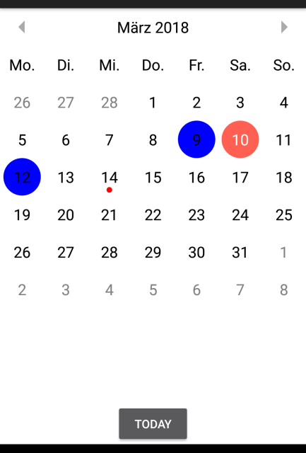

# Hyperloop calendar module for Android

used library: <https://github.com/prolificinteractive/material-calendarview>

[]

```javascript
var mcv = require("/calendar-android");
var calView = mcv.getView({
	mode: "month", // week or month
	arrowColor: "#AAAAAA",
	topbarVisible: true,
	selectionColor: "#ff6052",
	highlightColor: "#0000FF",
	dotRadius: 10.0, // radius of the dot below the date
	dotColor: "#ff0000" // color of the dot below the date
});

// click a date
calView.addEventListener("changed", onChangeDate);

// set dots below date
var d = [];
d.push(new Date(2018, 2, 14).getTime())
mcv.setDots(d);

// add events - background color behind a date
d = [];
d.push(new Date(2018, 2, 12).getTime())
d.push(new Date(2018, 2, 9).getTime())
mcv.setHighlights(d);

// select today
mcv.gotoToday();

function onChangeDate(date) {
	console.log(date);
}

function onClickToday(e) {
	// select today
	mcv.gotoToday();
}

$.btn_today.addEventListener("click", onClickToday);
$.index.add(calView);
$.index.open();

```
